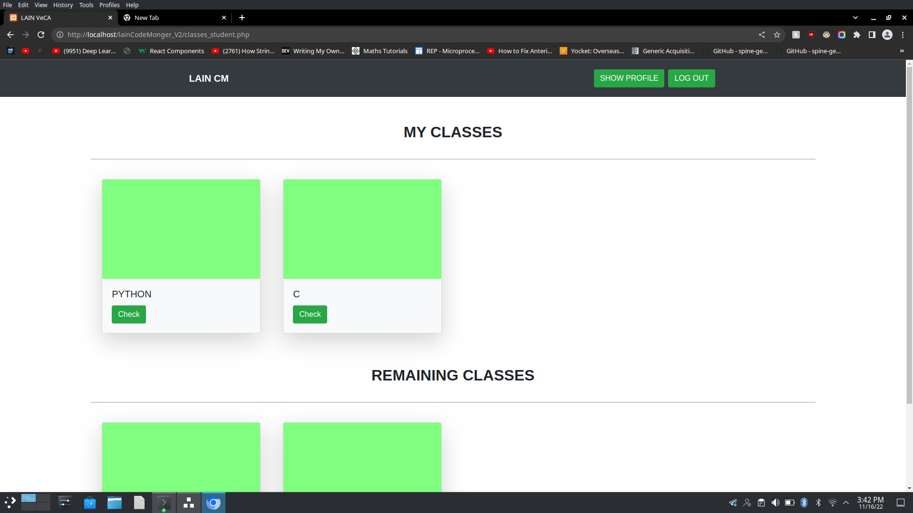
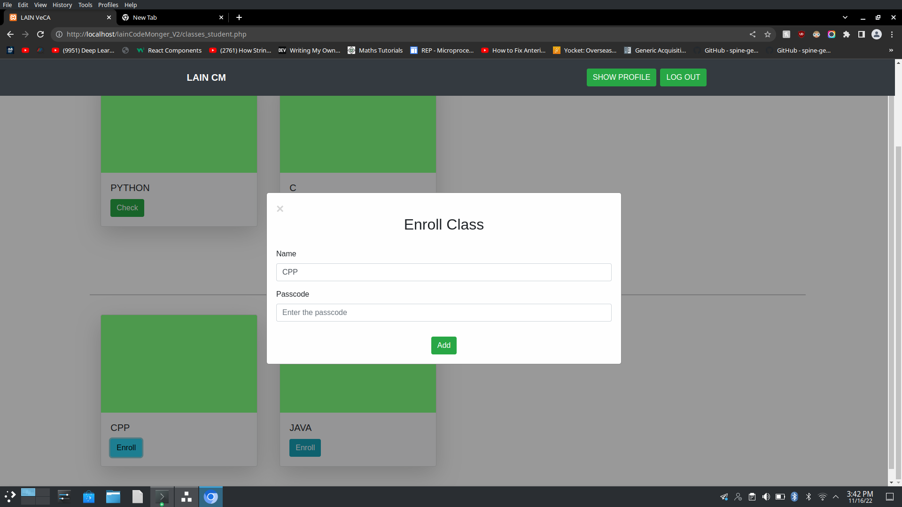
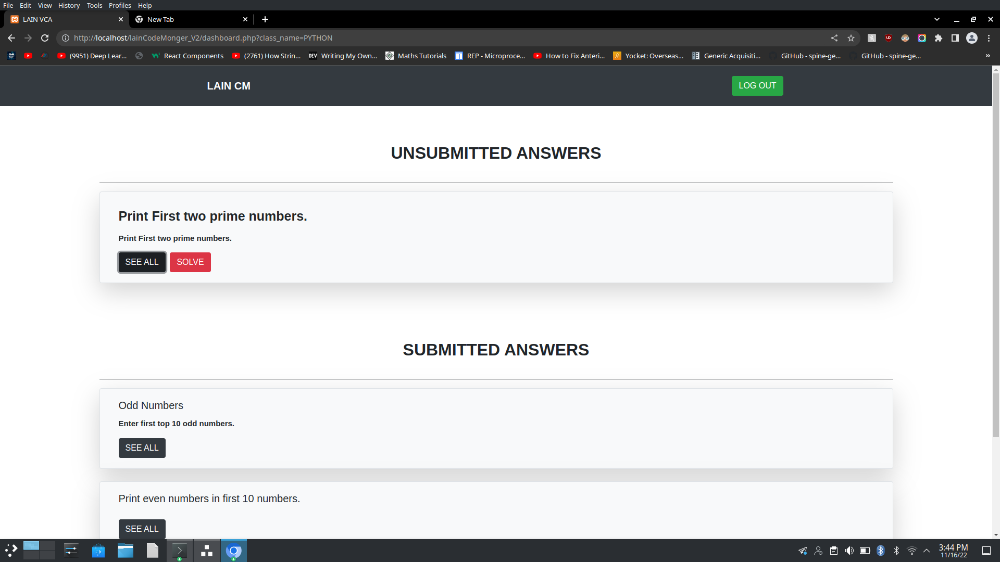
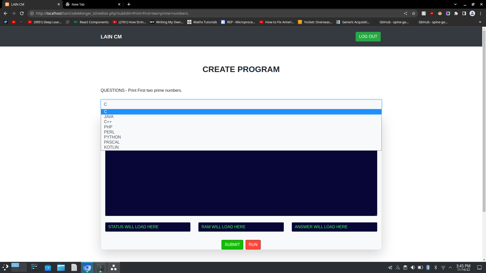
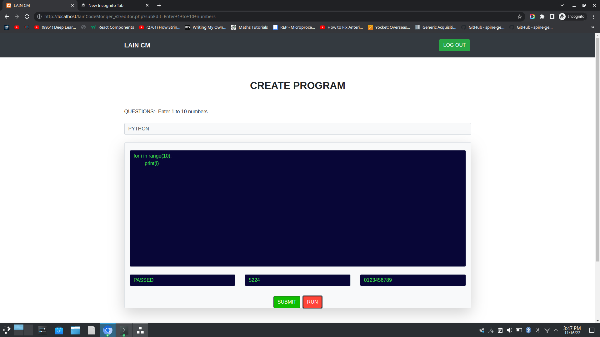
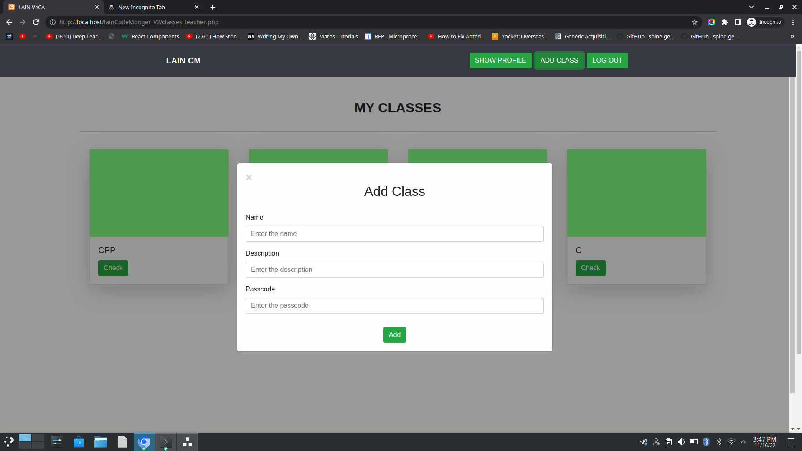
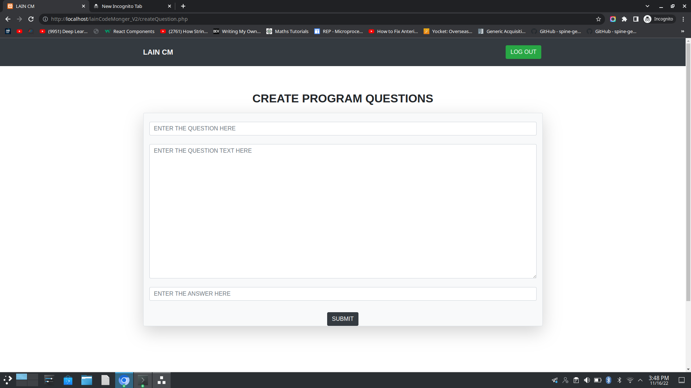
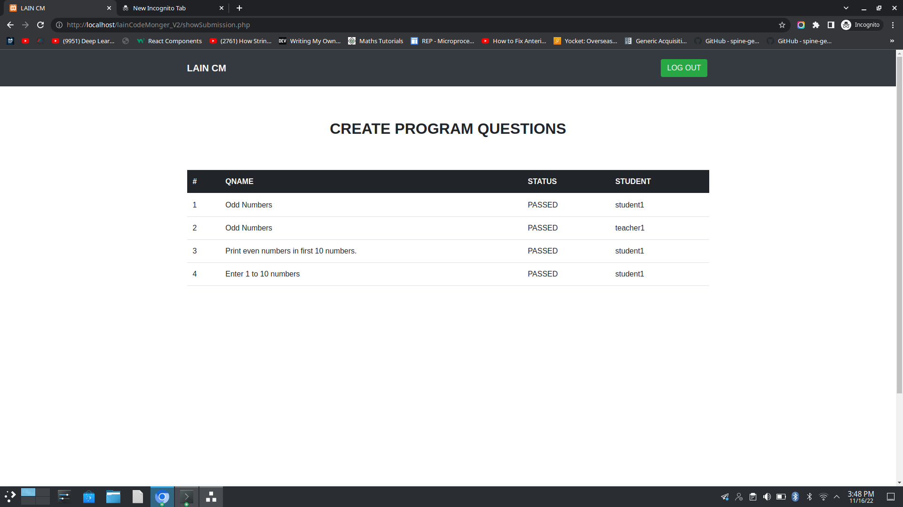
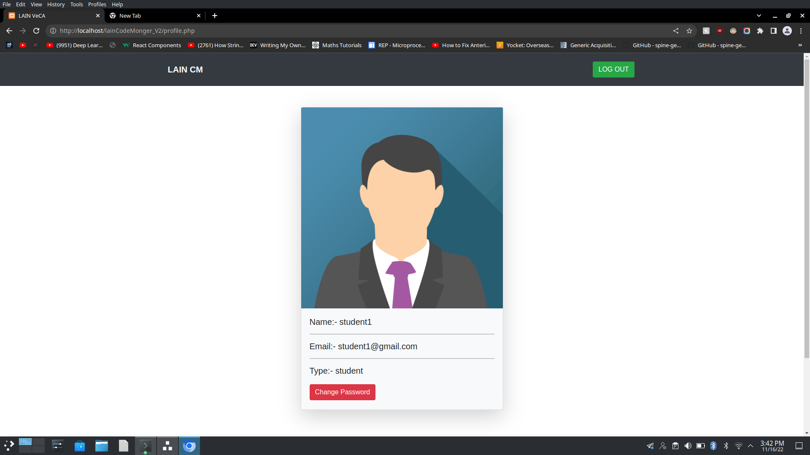

# Lain Code Monger

A web app which helps universities with automatic evaluation of coding assignment.Students and teachers can keep track of the work.

### Class Dashboard

### Class Enroll

### Assignment Dashboard

### Coding Editor

### Add class

### Add coding question

### Tracking of students work

### Profile

